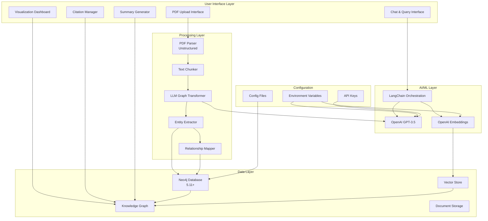
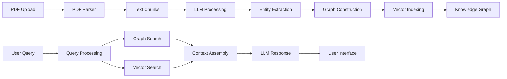
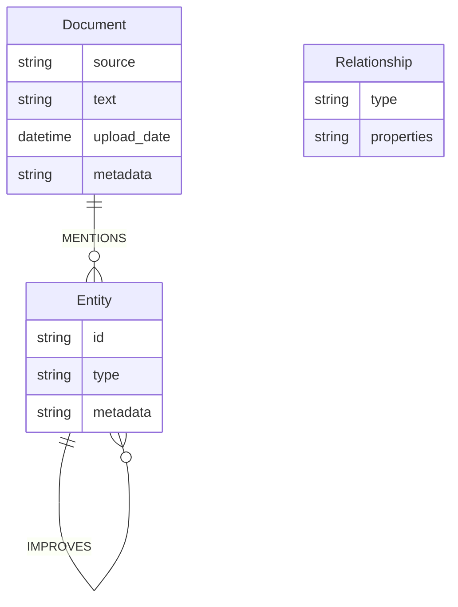
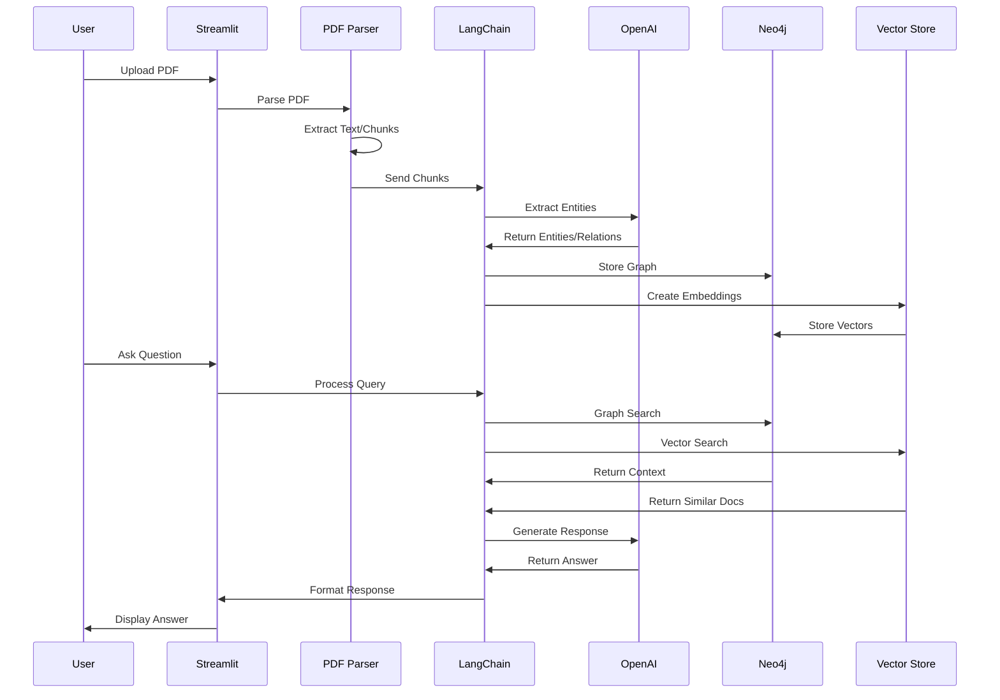
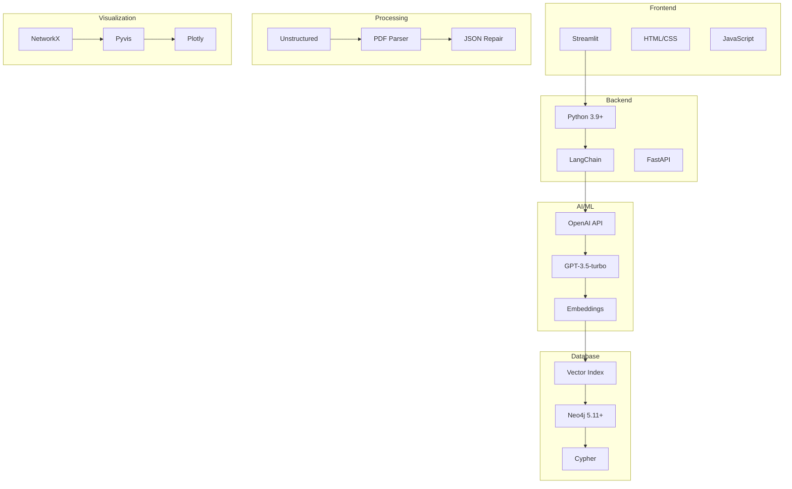

# InsightGPT - Mermaid Architecture Diagram

## System Architecture

```mermaid
graph TB
    subgraph "User Interface Layer"
        A[PDF Upload Interface]
        B[Chat & Query Interface]
        C[Visualization Dashboard]
        D[Citation Manager]
        E[Summary Generator]
    end
    
    subgraph "Processing Layer"
        F[PDF Parser<br/>Unstructured]
        G[Text Chunker]
        H[LLM Graph Transformer]
        I[Entity Extractor]
        J[Relationship Mapper]
    end
    
    subgraph "AI/ML Layer"
        K[OpenAI GPT-3.5]
        L[OpenAI Embeddings]
        M[LangChain Orchestration]
    end
    
    subgraph "Data Layer"
        N[Neo4j Database<br/>5.11+]
        O[Vector Store]
        P[Knowledge Graph]
        Q[Document Storage]
    end
    
    subgraph "Configuration"
        R[Environment Variables]
        S[Config Files]
        T[API Keys]
    end
    
    A --> F
    B --> M
    C --> P
    D --> P
    E --> P
    
    F --> G
    G --> H
    H --> I
    I --> J
    
    H --> K
    M --> K
    M --> L
    
    I --> N
    J --> N
    L --> O
    N --> P
    O --> P
    
    R --> K
    R --> L
    S --> N
    T --> K
```

## Data Flow Pipeline

```mermaid
flowchart LR
    A[PDF Upload] --> B[PDF Parser]
    B --> C[Text Chunks]
    C --> D[LLM Processing]
    D --> E[Entity Extraction]
    E --> F[Graph Construction]
    F --> G[Vector Indexing]
    G --> H[Knowledge Graph]
    
    I[User Query] --> J[Query Processing]
    J --> K[Graph Search]
    J --> L[Vector Search]
    K --> M[Context Assembly]
    L --> M
    M --> N[LLM Response]
    N --> O[User Interface]
```

## Knowledge Graph Schema

```mermaid
erDiagram
    Document {
        string source
        string text
        datetime upload_date
        string metadata
    }
    
    Entity {
        string id
        string type
        string metadata
    }
    
    Relationship {
        string type
        string properties
    }
    
    Document ||--o{ Entity : MENTIONS
    Entity ||--o{ Entity : USES
    Entity ||--o{ Entity : IMPLEMENTS
    Entity ||--o{ Entity : COMPARES
    Entity ||--o{ Entity : EXTENDS
    Entity ||--o{ Entity : BASED_ON
    Entity ||--o{ Entity : IMPROVES
```

## Component Interaction

```mermaid
sequenceDiagram
    participant U as User
    participant S as Streamlit
    participant P as PDF Parser
    participant L as LangChain
    participant O as OpenAI
    participant N as Neo4j
    participant V as Vector Store
    
    U->>S: Upload PDF
    S->>P: Parse PDF
    P->>P: Extract Text/Chunks
    P->>L: Send Chunks
    L->>O: Extract Entities
    O->>L: Return Entities/Relations
    L->>N: Store Graph
    L->>V: Create Embeddings
    V->>N: Store Vectors
    
    U->>S: Ask Question
    S->>L: Process Query
    L->>N: Graph Search
    L->>V: Vector Search
    N->>L: Return Context
    V->>L: Return Similar Docs
    L->>O: Generate Response
    O->>L: Return Answer
    L->>S: Format Response
    S->>U: Display Answer
```

## Technology Stack

```mermaid
graph TB
    subgraph "Frontend"
        A[Streamlit]
        B[HTML/CSS]
        C[JavaScript]
    end
    
    subgraph "Backend"
        D[Python 3.9+]
        E[LangChain]
        F[FastAPI]
    end
    
    subgraph "Database"
        G[Neo4j 5.11+]
        H[Cypher]
        I[Vector Index]
    end
    
    subgraph "AI/ML"
        J[OpenAI API]
        K[GPT-3.5-turbo]
        L[Embeddings]
    end
    
    subgraph "Processing"
        M[Unstructured]
        N[PDF Parser]
        O[JSON Repair]
    end
    
    subgraph "Visualization"
        P[NetworkX]
        Q[Pyvis]
        R[Plotly]
    end
    
    A --> D
    D --> E
    E --> J
    J --> K
    K --> L
    L --> I
    I --> G
    G --> H
    M --> N
    N --> O
    P --> Q
    Q --> R
```

